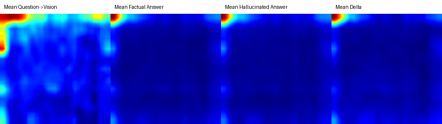
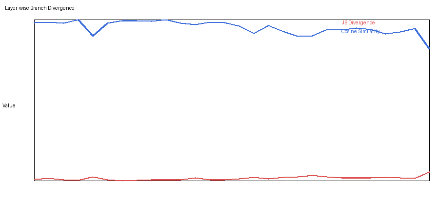
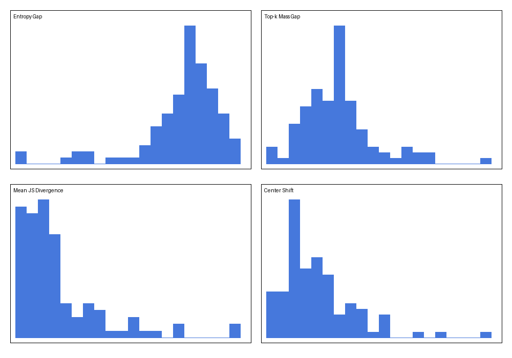
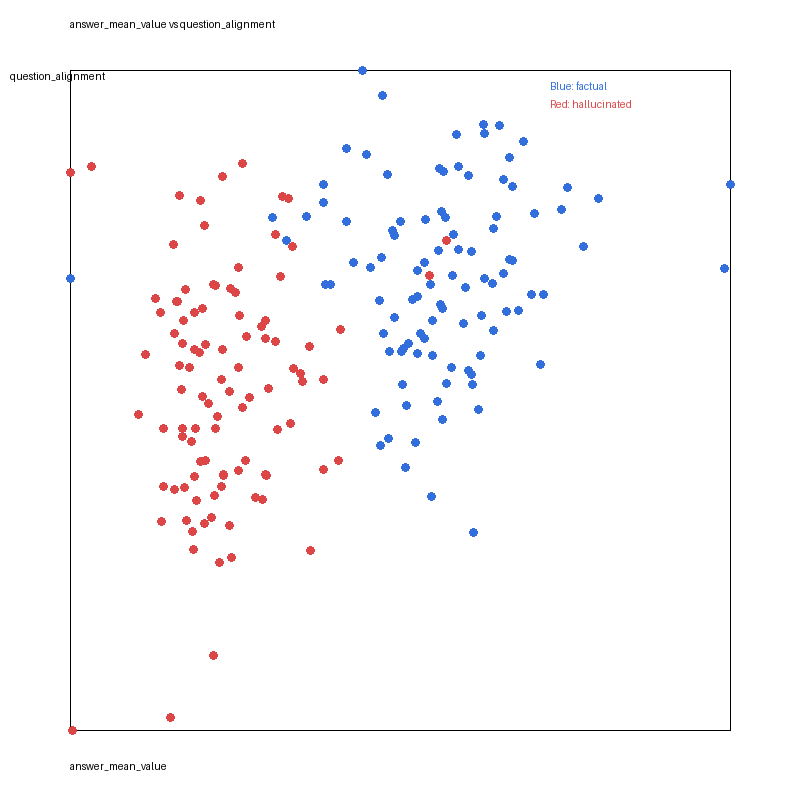
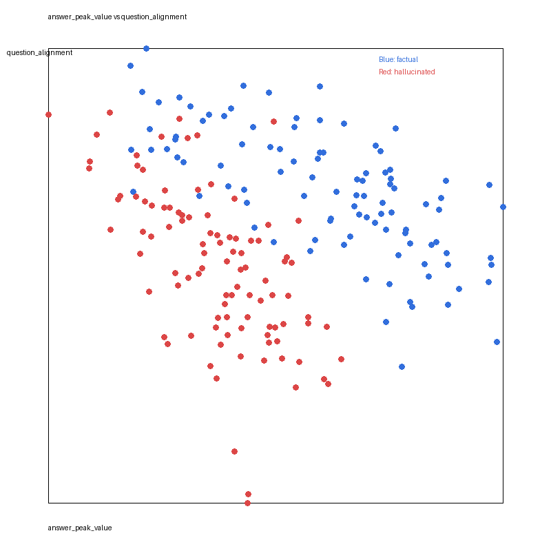
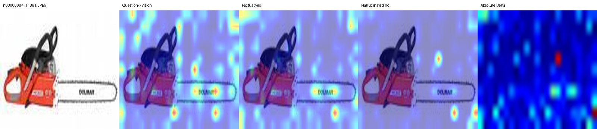
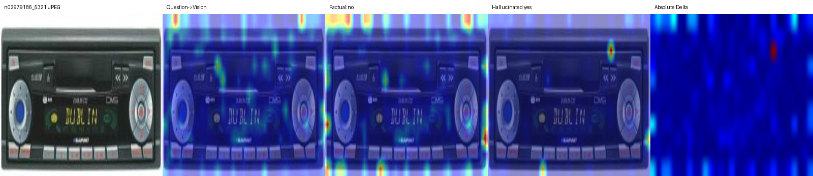
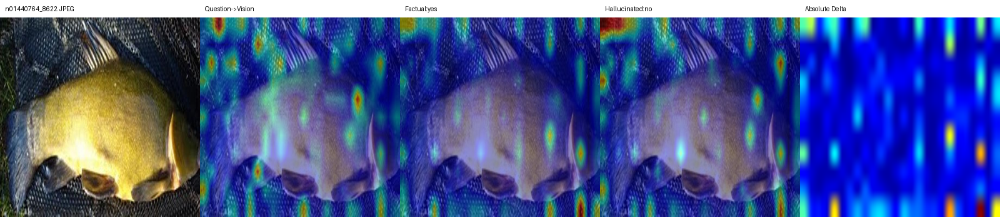

# Verify How Different Cross-Attention Mechanisms Behave Between Hallucinated and Factual Tokens on VLM

## Overview
This repository studies whether `Q(text) -> K(image)` cross-attention can separate factual answer tokens from hallucinated answer tokens in a vision-language model.

The experiment uses `Qwen2.5-VL-7B-Instruct` on 100 ImageNette images with yes/no questions of the form:

- `Is there a/an [object] in the image?`

For each image-question pair, the pipeline generates:

- a factual answer token
- a hallucinated answer token that is forced to be the opposite of the factual answer

Then it exports and visualizes:

- `question -> vision` cross-attention
- `factual answer token -> vision` cross-attention
- `hallucinated answer token -> vision` cross-attention
- `delta = hallucinated - factual`

## Core Question
Can hallucinated and factual answer tokens be separated using cross-attention statistics?

This repository evaluates two hypotheses:

1. A scalar threshold exists that can separate hallucinated and factual tokens.
2. A low-dimensional linear hyperplane exists that separates them even better.

## Method
### Attention definition
The analysis uses the attention weights produced by the language model when:

- text tokens are the query `Q`
- image tokens are the key `K`

In practice, we analyze:

- question token set -> merged image token grid
- factual answer token -> merged image token grid
- hallucinated answer token -> merged image token grid

### Spatial reconstruction
`Qwen2.5-VL` merges image tokens before the language model. In this setup the merged attention grid is `11 x 17`, which is reconstructed into 2D spatial heatmaps.

### Token-level samples
Each original record yields two token samples:

- class `0`: factual answer token
- class `1`: hallucinated answer token

For every token sample we compute features such as:

- `question_alignment`
- `question_center_shift`
- `answer_entropy`
- `answer_topk_mass`
- `answer_peak_value`
- `answer_mean_value`
- `pair_js_divergence`
- `pair_cosine_similarity`
- `pair_center_shift`

## Main Visualizations
### Dataset-level summary



This panel summarizes:

- mean `question -> vision`
- mean `factual answer -> vision`
- mean `hallucinated answer -> vision`
- mean absolute delta

### Layer-wise divergence



This figure shows how factual and hallucinated branches diverge across layers.

### Metric distributions



This figure summarizes the distribution of several discriminative statistics over the 100-image dataset.

### Separability scatter views





These pairwise projections already show that factual and hallucinated tokens occupy different regions of feature space, especially when `question_alignment` is combined with answer-attention magnitude features.

## Separability Results
The strongest scalar threshold found in this experiment is:

- feature: `answer_mean_value`
- rule: `answer_mean_value <= 0.00022780504853775103`
- balanced accuracy: `0.955`
- precision: `0.9505`
- recall: `0.96`

This means a simple threshold on the average spatial attention mass is already highly informative for distinguishing hallucinated tokens from factual tokens.

The strongest low-dimensional linear separator uses:

- `question_alignment`
- `answer_topk_mass`
- `answer_mean_value`
- `pair_cosine_similarity`

Its performance is:

- balanced accuracy: `0.975`
- accuracy: `0.975`
- precision: `0.9703`
- recall: `0.98`

The corresponding linear model weights are:

- `question_alignment`: `-1.2532`
- `answer_topk_mass`: `-1.0133`
- `answer_mean_value`: `-5.9686`
- `pair_cosine_similarity`: `0.6419`

## Interpretation
The current evidence supports both conclusions:

1. A useful scalar threshold exists.
2. A stronger low-dimensional linear separator also exists.

So the gap between factual and hallucinated tokens is not only a vague statistical tendency. It is strong enough to produce:

- a near-threshold mechanism
- an even cleaner linear separation in a small feature space

This suggests hallucinated answer tokens are systematically different from factual answer tokens in how they align to question evidence and image-space attention statistics.

## Representative High-Separation Cases
The most discriminative samples in the current run include:

1. `chain saw` with factual `yes` and hallucinated `no`
2. `cassette player` with factual `no` and hallucinated `yes`
3. `tench` with factual `yes` and hallucinated `no`

Representative overlays:







Their exact scores are recorded in:

- `outputs/qwen_attention_100/visualizations/dataset_summary/attention_discriminability.csv`

## Generated Artifacts
### Outputs
- `outputs/qwen_attention_100/attention_records.jsonl`
- `outputs/qwen_attention_100/visualizations/per_sample/`
- `outputs/qwen_attention_100/visualizations/dataset_summary/`
- `outputs/qwen_attention_100/visualizations/dataset_summary/separability/`

### Scripts
- `scripts/run_qwen_attention.py`
- `scripts/visualize_qwen_attention.py`
- `scripts/analyze_attention_separability.py`
- `scripts/run_qwen_attention_100.sh`

## Reproducibility
The end-to-end run is orchestrated by:

```bash
./scripts/run_qwen_attention_100.sh
```

The separability analysis is generated by:

```bash
python scripts/analyze_attention_separability.py \
  --input-jsonl outputs/qwen_attention_100/attention_records.jsonl \
  --output-dir outputs/qwen_attention_100/visualizations/dataset_summary/separability
```

## Takeaway
Under this `Q(text) -> K(image)` cross-attention analysis, hallucinated answer tokens are not merely noisy variants of factual tokens. They occupy a measurably different region of attention-feature space, and that difference is strong enough to support both a scalar threshold and a low-dimensional linear separator.
