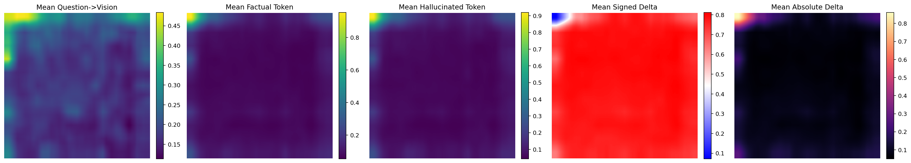
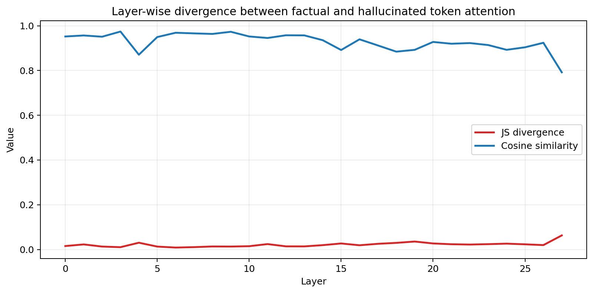
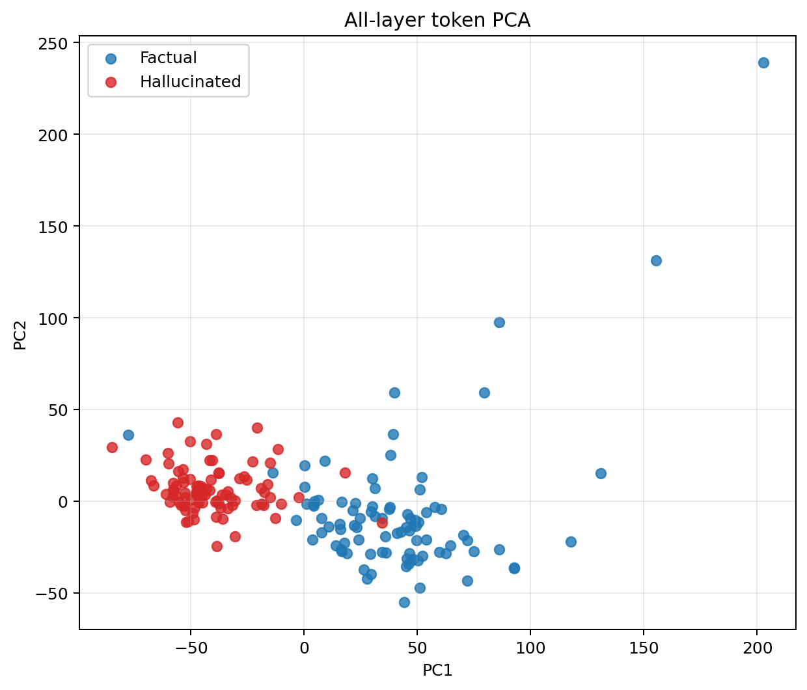
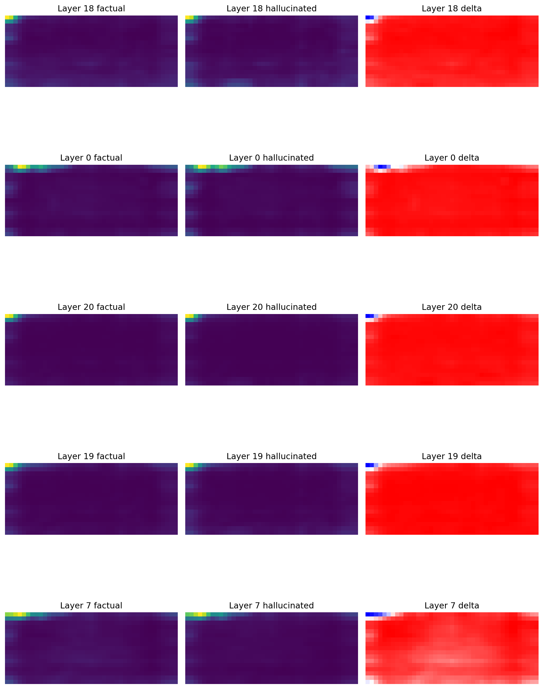
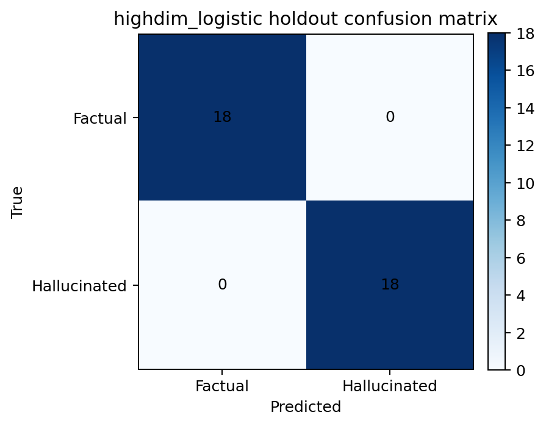

# Verify How Different Cross-Attention Mechanisms Behave Between Hallucinated and Factual Tokens on VLM

## Overview
This repository studies whether answer-token `Q(text) -> K(image)` cross-attention can distinguish factual and hallucinated responses in `Qwen2.5-VL-7B-Instruct`.

The current experiment uses 100 `ImageNette` images with fixed binary prompts:

- `Is there a/an [object] in the image?`

For each image-question pair, the pipeline generates:

- a factual answer token, expected to be `yes`
- a hallucinated answer token, forced to be the opposite answer `no`

For both branches, the code exports the answer token's cross-attention map for every layer, along with the question-token cross-attention map.

## Dataset And Protocol
The dataset is built from a balanced 100-image `ImageNette` subset stored in:

- `outputs/imagenette_subset_100.jsonl`

Each record contains:

- `sample_id`
- `image_path`
- `class_id`
- `object_label`
- `question`
- `expected_answer`
- `hallucinated_answer_target`

The generation protocol is:

1. factual branch: `image + question -> yes`
2. hallucination branch: `image + question -> forced no`
3. export per-layer cross-attention maps for the answer token in both branches

Out of 100 inputs, 89 records were valid contrastive samples where:

- the factual branch answered `yes`
- the hallucination branch produced the forced `no`

## What Is Recorded
Every valid record stores:

- `factual_question_attention`
- `hallucinated_question_attention`
- `factual_trace`
- `hallucinated_trace`
- `factual_meta`
- `hallucinated_meta`

Each answer trace contains the generated token, token id, and a `cross_attention` object with:

- `layer_maps`: one 2D attention map per layer
- `layer_summary`: mean, early, middle, and late layer summaries

That means this repository keeps the full layerwise attention map for the factual token and the hallucinated token, not only aggregated statistics.

## Main Results
### Dataset summary heatmaps



This figure summarizes the dataset-level mean attention for:

- question -> vision
- factual token -> vision
- hallucinated token -> vision
- signed delta
- absolute delta

### Layer divergence



The divergence curve shows that the factual and hallucinated token branches do not separate uniformly across depth. The strongest differences concentrate in a smaller subset of layers rather than being evenly spread across the whole network.

### All-layer PCA



This PCA uses flattened layerwise answer-token attention features across all layers. The two token classes already occupy visibly different regions.

### Top-layer spotlight



This panel visualizes the strongest single layers discovered by layer-wise PCA ranking.

### High-dimensional classifier



The strongest classifier in this run is the high-dimensional logistic regression trained on resized layerwise attention features.

## PCA And Important Layers
The layer ranking report is stored in:

- `outputs/qwen_attention_imagenette_100/viz/layer_analysis/layer_analysis_report.json`

The strongest individual layers are:

1. layer `18`
2. layer `0`
3. layer `20`
4. layer `19`
5. layer `7`

The strongest contiguous 3-layer bands are:

1. layers `18-20`
2. layers `17-19`
3. layers `19-21`
4. layers `16-18`
5. layers `20-22`

This suggests the most useful factual-vs-hallucinated separation is concentrated around a late-middle band centered near layers `18-20`.

## Classifier Performance
The full classifier report is stored in:

- `outputs/qwen_attention_imagenette_100/analysis/classifier_summary.json`

Key results on 89 valid records / 178 token samples:

- high-dimensional logistic regression:
  - mean cross-validation accuracy: `0.9941`
  - mean balanced accuracy: `0.9941`
  - mean precision: `0.9889`
  - mean recall: `1.0000`
  - mean ROC-AUC: `0.9896`
- scalar logistic baseline:
  - mean cross-validation accuracy: `0.9546`
  - mean balanced accuracy: `0.9546`
  - mean precision: `0.9450`
  - mean recall: `0.9660`
  - mean ROC-AUC: `0.9913`

So the high-dimensional classifier clearly improves over the scalar baseline, which supports the idea that the full layerwise spatial attention pattern carries richer class information than low-dimensional summary statistics alone.

## Repository Layout
### Scripts

- `scripts/prepare_imagenette_subset.py`
- `scripts/run_qwen_attention.py`
- `scripts/visualize_qwen_attention.py`
- `scripts/analyze_attention_separability.py`
- `scripts/attention_binary_utils.py`
- `scripts/run_qwen_attention_100.sh`

### Outputs

- `outputs/imagenette_subset_100.jsonl`
- `outputs/qwen_attention_imagenette_100/all_records.jsonl`
- `outputs/qwen_attention_imagenette_100/valid_records.jsonl`
- `outputs/qwen_attention_imagenette_100/failures.csv`
- `outputs/qwen_attention_imagenette_100/viz/`
- `outputs/qwen_attention_imagenette_100/analysis/`

## Reproducibility
The full remote pipeline is wrapped by:

```bash
./scripts/run_qwen_attention_100.sh
```

The three stages are:

1. build the 100-image `ImageNette` subset
2. run factual/hallucinated token tracing with `Qwen2.5-VL-7B-Instruct`
3. run `matplotlib` visualization, PCA ranking, and high-dimensional classifier analysis

## Takeaway
Under this binary `ImageNette` setting, factual and hallucinated answer tokens are not merely noisy variants of each other. Their layerwise spatial cross-attention maps are strongly separable:

- PCA identifies a small set of especially informative layers
- the strongest band is concentrated around layers `18-20`
- a high-dimensional classifier reaches near-perfect balanced accuracy on token labeling

This provides strong evidence that factual and hallucinated tokens occupy different regions of attention space when the model answers the same image-grounded yes/no question.
